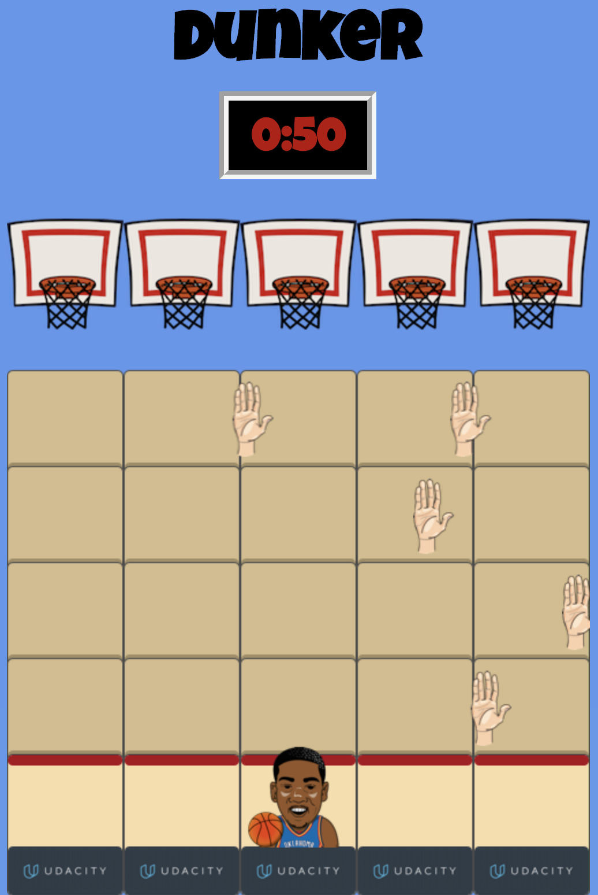

Dunker The Game - Front-End Advanced-Nanodegree 
===============================================

 

## Description
This is a different version of the classic arcade game Frogger, this is a minimalist 2D game which the objective is to make the Dunk after avoiding the enemies(Hands) around the court.

## How to View This Page
Clone or download this repository, then open _index.html_ in your browser.

The easiest way to play the game is by clicking the link below:

https://evandrolorran.github.io/dunker-arcade-game/

## How to Play - Controls
Use left-right and up-down arrow keys to move the player from block to block. Collision with enemy(Hands) results in death and reduced score, while reaching the basket you score 2 points.

## Tools used to create this game:
* JavaScript
* CSS3
* HTML5
* IDE - Visual Studio Code
* Sketch

## Resources

[UI Design - Sketch](https://github.com/evandrolorran/ui-design-dunker-game)

### Author
The game was developed by [evandrolorran](https://github.com/evandrolorran) for Udacity's [Web Front-End Advanced Nanodegree Program](https://br.udacity.com/course/front-end-web-developer-nanodegree--nd001-br-advanced) program, and is based on their 'starting point' [repository](https://github.com/udacity/frontend-nanodegree-arcade-game).

### Contact
evandrolorran@gmail.com

### Special Thanks / Mentions
Player full image created by [ERIC PENG](http://www.shakethecan.net/about/)

## Front-end Nanodegree guide to this project

Students should use this [rubric](https://review.udacity.com/#!/projects/2696458597/rubric) for self-checking their submission. Make sure the functions you write are **object-oriented** - either class functions (like Player and Enemy) or class prototype functions such as Enemy.prototype.checkCollisions, and that the keyword 'this' is used appropriately within your class and class prototype functions to refer to the object the function is called upon. Also be sure that the **readme.md** file is updated with your instructions on both how to 1. Run and 2. Play your arcade game.

For detailed instructions on how to get started, check out this [guide](https://docs.google.com/document/d/1v01aScPjSWCCWQLIpFqvg3-vXLH2e8_SZQKC8jNO0Dc/pub?embedded=true).
